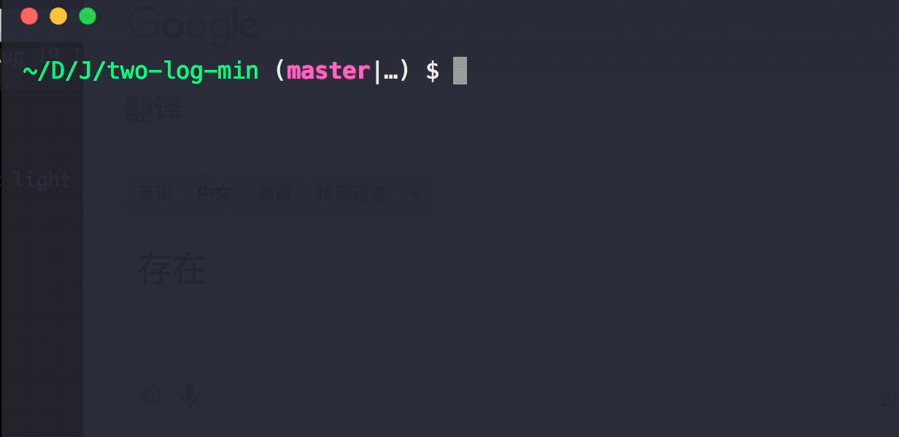

# two-log-min [](https://travis-ci.org/chinanf-boy/two-log-min) [](https://codecov.io/gh/chinanf-boy/two-log-min?branch=master) [](https://github.com/chinanf-boy/two-log-min-explain)

> 选择 `ora` 和 `debug` 日志的其中一个, if `debug == true` log => `debug`, else log => `ora`

[中文](./readme.zh.md)

## 看一看

```
npm i -g two-log-min
```

<p>


</p>

## 命令行用法

```js
// cli.js
const twoLog = require('two-log-min');
let D = cli.flags['D'] || false
let l = twoLog(D);


let useWhat = !D ? 'ora' : 'log';

const o1 = {
	ora: 'red',
	log: 'cli'
}

const backLog = l.start(`hello debug:${D} , then use ${c(useWhat)} ${m(toS(o1))}`, o1);

setTimeout(() => {
	backLog(`use backLog ${c('withou log 名称space')}`);
}, t - 5000);


const o2 = {
	ora: 'green',
	log: 'cli'
}

setTimeout(() => {
	l.text(`ora:green, log:cli`, o2);

	l.one('one time ora');
}, t - 3000);

const o3 =  {
	ora: 'green',
	log: 'cli',
	only: 'log',
}

setTimeout(() => {
	l.text(`ora:green, only show log`, o3);
}, t - 2000);

const o4 = {
	ora: 'fail',
	log: 'cli'
}

setTimeout(() => {
	l.stop(`i fail if ora `, o4);
}, t);

```

### l.start === loggerStart

### l.text === loggerText

### l.stop === loggerStop

### l.one === oneOra

> logger`***` 可以给予其他模块使用,而不需要 `l = twoLog(D)` init

---

## API

### twoLog(debug, userUser):[log](#log)

#### debug

| 名称: | debug             |
| ----- | ----------------- |
| 类型: | `boolean`|`string`         |
| 描述: | false 选择 `ora`, true 选择 全开`debug`, string 命名调试 |

#### userUse(api)

| 名称:    | userUse                        |
| -------- | ------------------------------ |
| 类型:    | `function(api)`                |
| 默认: | `undefined`                    |
| 描述:    | 对 debug 的自定义设置 |

##### api

| 名称:       | api             |
| ----------- | --------------- |
| 类型:       | `object`        |
| 描述:       | 给用户使用的 api     |
| api.log:    | log = require('debug') |
| api.ora:    | ora = require('ora') |


<details>

<summary>
api 用例
</summary>

- [user api : debug 格式自定义](./example/userApi.js)

```js
let userUse = api => {
	let createDebug = api.log;
	createDebug.formatters.h = (v) => {
	return v.toString('hex')
	}
};

let l = twoLog(true, userUse);

const debug = l.start('something str',{log:'foo'})
debug('this is hex: %h', new Buffer('hello world'))
//   foo this is hex: 68656c6c6f20776f726c6421 +0ms
```

</details>

---

### log

| 名称:    | log                     |
| -------- | ----------------------- |
| 类型:    | `any`                   |
| 描述:    | log api                 |
| 默认: | `{ start, text, stop, one }` |
| Details: | `start === [loggerStart](#loggerstartstr-options)` |
| Details: | `text === [loggerText](#loggertextstr-options)`   |
| Details: | `stop === [loggerStop](#loggerstopstr-options)`   |
| Details: | `one === oneOra`        |

---

### loggerStart(str, options):[strLog](#strlog)

#### str

| 名称: | str      |
| ----- | -------- |
| 类型: | `string` |
| 描述: | 开始 log, |
| 被`...args`扩展: | start('one','two',opts) , `one` +/% 格式化 `two` 和一起 |

#### options

| 名称:         | options                                    |
| ------------- | ------------------------------------------ |
| 类型:         | `any`                                      |
| 默认:      | `{ ora: 'yellow', log: `pkgName`, only:"" }` |
| 描述:         | 配置 日志                                   |
| options.ora:  | ora color                                  |
| options.log:  | debug命名空间                    |
| options.only: | 限制只其中 {'ora' \| 'log'} 能输出      |

> `pkgName` is the most closest package.json 名称

#### strLog(...args)

| 名称: | strLog      |
| ----- | -------- |
| 类型: | `Function` |
| 描述: | 方便使用`debug`,不用加命名空间, 也可以改`ora`的字|
| 被`...args`扩展: | log('one &h','two') , `one` +/% 格式化 `two` 和一起 |

<details>

<summary> 示例: 使用 strLog </summary>

``` js
const twoLog = require('../index')

let l = twoLog(true);

const strLog = l.start('something str',{log:'foo'}) //设置 命名空间
strLog('this is hex: %h', new Buffer('hello world')) // 加上上面那个示例
```

[code >>>](./example/strLog.js)

</details>


### loggerText(str, options)

#### str

| 名称: | str      |
| ----- | -------- |
| 类型: | `string` |
| 描述: | log text |
| 被`...args`扩展: | text('one','two',opts) , `one` +/% 格式化 `two` 和一起 |

#### options

| 名称:         | options                                    |
| ------------- | ------------------------------------------ |
| 类型:         | `any`                                      |
| 默认:      | `{ ora: 'yellow', log: `pkgName`, only:"" }` |
| 描述:         | 配置日志                                   |
| options.ora:  | ora color                                  |
| options.log:  | debug命名空间                     |
| options.only: | 限制只其中 {'ora' \| 'log'} 能输出         |

> `pkgName` is the most closest package.json 名称

### loggerStop(str, options)

#### str

| 名称: | str      |
| ----- | -------- |
| 类型: | `string` |
| 描述: | 停止 日志 |
| 被`...args`扩展: | stop('one','two',opts) , `one` +/% 格式化 `two` 和一起 |

#### options

| 名称:         | options                                                                  |
| ------------- | ------------------------------------------------------------------------ |
| 类型:         | `any`                                                                    |
| 默认:      | `{ ora: '', log: pkgName, only:"" }`                                     |
| 描述:         | 配置日志                                                                 |
| options.ora:  | ora {`fail\|succeed\|warn`} https://github.com/sindresorhus/ora#instance |
| options.log:  | debug命名空间                                                   |
| options.only: | only one {'ora' \| 'log'} can use                                        |

### oneOra(str, options)

#### str

| 名称: | str      |
| ----- | -------- |
| 类型: | `string` |
| 描述: | ora 一次表现 |
| 被`...args`扩展: | one('one','two',opts) , `one` +/% 格式化 `two` 和一起 |

#### options

| 名称:          | options                                                                  |
| -------------- | ------------------------------------------------------------------------ |
| 类型:          | `any`                                                                    |
| 默认:       | `{ color: 'yellow', end: 'succeed' }`                                    |
| 描述:          | 输出 一次 成功/失败/警告 的  ora                                                             |
| options.end:   | end {`fail\|succeed\|warn`} https://github.com/sindresorhus/ora#instance |
| options.color: | color         for ota                                                           |

---

## CLI

> just Demo

```
npm install --global two-log-min
```

```
$ two-log-min --help

	Usage
	  $ two-log-min -D

	Options
	  -D  Debug [默认: false]

	Examples
	  $ two-log-min
	  ora show
	  $ two-log-min -D
	  all debug show
	  $ two-log-min -D cli
	  debug:cli show
```

## concat

- [two-log](https://github.com/chinanf-boy/two-log) just need two log, `ora` / `winston`

## License

MIT © [chinanf-boy](http://llever.com)
